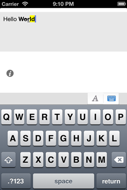
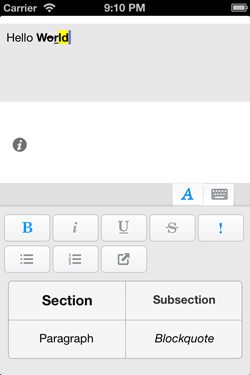

P2MSTextView (OnGoing)
============
This project is inspired by the Evernote application for IOS.  

This is supposed to work on IOS 4.3+.

###Usage
Implements "P2MSTextViewDelegate" protocol to receive messages from "P2MSTextView" (optional)

    P2MSTextView *textView = [[P2MSTextView alloc]initWithFrame:textViewRect];
    textView.textViewDelegate = self;
    [self.view addSubview:textView];
#####Import/Export HTML string
	//Import HTML
	[textView importHTMLString:@"Hello <b>W<strike>o</strike><u>r</u><mark>l</mark><i>d</i></b>"];

	//export HTML
	[textView exportHTMLString];
*exported HTML is now fragmented and will improve it later*
#####Import/Export Plain string
	//import text
	textView.plainText = @"Hello World";
	//export text
	NSString *exported = textView.plainText;
######HTML Mapping
    NSDictionary *txtFmtReferenceTable = [NSMutableDictionary dictionaryWithObjects:
                                          [NSArray arrayWithObjects:
                                           [NSNumber numberWithInt:TEXT_BOLD],
                                           [NSNumber numberWithInt:TEXT_ITALIC],
                                           [NSNumber numberWithInt:TEXT_UNDERLINE],
                                           [NSNumber numberWithInt:TEXT_STRIKE_THROUGH],
                                           [NSNumber numberWithInt:TEXT_HIGHLIGHT],
                                           [NSNumber numberWithInt:PARAGRAPH_BULLET],
                                           [NSNumber numberWithInt:PARAGRAPH_NUMBERING],
                                           [NSNumber numberWithInt:PARAGRAPH_SECTION],
                                           [NSNumber numberWithInt:PARAGRAPH_SUBSECTION],
                                           [NSNumber numberWithInt:PARAGRAPH_BLOCK_QUOTE],
                                           [NSNumber numberWithInt:PARAGRAPH_NORMAL],
                                           [NSNumber numberWithInt:TEXT_FORMAT_NONE],
                                           [NSNumber numberWithInt:PARAGRAPH_NORMAL],
                                           nil] forKeys:
                                          [NSArray arrayWithObjects:@"b", @"i", @"u", @"strike", @"mark", @"ul", @"ol", @"h3", @"h5", @"blockquote", @"li", @"NO_HTML", @"a",
                                           nil]];

#####Switching between default Keyboards
	[textView toggleKeyboard];
#####Show Specific Keyboard
	[textView showKeyboard:KEYBOARD_TYPE_DEFAULT];
	  (or)
	[textView showKeyboard:KEYBOARD_TYPE_FORMAT];

 
Refer to **"P2MSTextViewExampleViewController"** for more information.

###Importance Notes
***The code and concepts require a lot of improvements and haven't tested well.*** 

The current codes are not efficient since I decided not to manipulate directly on **NSAttributedString** when I started working on this project, hoping to reuse the same approach on other platforms. I later will work directly on **NSAttributedString**.

Please open an issue or contact <ptwoms@gmail.com> for the bugs or improvement ideas.

###Contributions
- Contributions and suggestions are welcome
